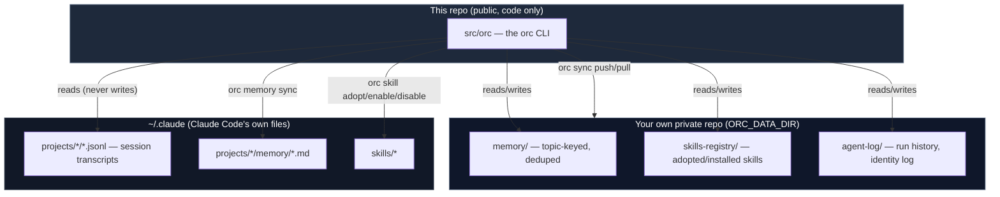

# claude-orchestrator

A personal control plane for a [Claude Code](https://claude.com/claude-code) setup that spans multiple accounts, multiple machines, and a pile of hand-installed skills — so none of that state is pinned to whichever login happens to be active right now.

`orc` never calls the Anthropic API and never checks your subscription. It only reads and writes local files: your existing `~/.claude/projects/*/memory/*.md`, your session transcripts (`~/.claude/projects/*/*.jsonl`, where real token-usage numbers come from), your `~/.claude/skills/*`, and its own small private data store. It works with no Claude account logged in at all — the only network call anywhere in it is `orc sync`, and that talks to your own git remote, not Anthropic.

## Why

Three problems, one root cause — state trapped on a single machine/account instead of following the person:

1. **Memory is fragmented and misfiled.** Claude Code's own per-project memory is keyed by working-directory path, not topic. Notes about one long-running effort end up scattered across a dozen unrelated project folders purely because of whatever `cwd` you happened to be in.
2. **Accounts rotate.** Your own account, a shared one, a client's — swapped whenever one hits a rate limit. Nothing should leak into someone else's environment, and nothing should vanish when you step away from your own login.
3. **Skills are ad-hoc.** Some come from a marketplace, some are hand-downloaded from random GitHub repos with no record of source, version, or whether they're still wanted.

## Architecture: two repos, on purpose

This code is public. Your actual data is not — and never touches this repo.



`ORC_DATA_DIR` (default `~/.orc-data`) points at your private data repo. Update this tool with a normal `git pull` on this repo; sync *your* data with `orc sync`, which operates on `ORC_DATA_DIR`, never on this checkout.

## Install

Pick one:

**As a Python package** (recommended — gives you a real `orc` command, no PATH setup):
```bash
pip install claude-orchestrator          # or: pipx install claude-orchestrator
```

**Zero-install, from a clone:**
```bash
git clone https://github.com/Pranav-error/claude-orchestrator ~/claude-orchestrator
echo 'export PATH="$HOME/claude-orchestrator/bin:$PATH"' >> ~/.zshrc   # or ~/.bashrc
source ~/.zshrc
```

Either way, then:
```bash
orc init          # bootstraps your private data directory + git repo
orc identity set mine
orc dashboard
```

`orc init` prints the one manual step left (creating an actual private remote — `gh repo create --private` or any git host) so your data can sync across machines too. No dependencies beyond Python 3.10+ and git — the CLI is stdlib-only.

**As a Claude Code plugin** (adds `/orc` and an auto-invoked skill that reaches for `orc` on its own when relevant — install the CLI above first, this just teaches Claude about it):
```
/plugin marketplace add Pranav-error/claude-orchestrator
/plugin install claude-orchestrator@claude-orchestrator
```

## What it does

| | |
|---|---|
| **Memory** | `orc memory sync` mirrors Claude Code's scattered per-project memory into one topic-keyed, deduped store. `orc memory search`, `orc memory links`/`link` for `[[wiki-style]]` cross-references. |
| **Identity** | `orc identity set <label>` records which account is active on this machine right now — since Claude Code itself never does, and a filesystem never changes on an account swap on the same box (only a different *machine* needs `orc sync`). |
| **Usage** | `orc usage report --by day\|project\|model\|identity` — real token counts read straight from Claude Code's own transcripts. Nothing tracked manually. |
| **Skills** | `orc skill adopt/install/enable/disable` — takes custody of a skill (moves it into your data repo, symlinks it back), so hand-downloaded skills have a recorded source and travel with `orc sync` instead of needing manual reinstall per machine. |
| **Agent log** | `orc agent log/list` — append-only record of subagent runs, filterable by account/outcome/date. |
| **Sync** | `orc sync push/pull/status` — wraps git for your private data repo. Refuses to pull over uncommitted local changes rather than guessing how to merge them. |
| **Dashboard** | `orc dashboard` — a colored snapshot rendered directly in your terminal (boxed header, usage bar chart, skills, recent runs). No browser, no server. `--html` opts into a shareable file instead. |
| **Config** | `orc config show/set` — theme (amber/ocean/sunset/mono), icons on/off, usage window, forced color. |

Full command reference: [USAGE.md](USAGE.md).

Bare `orc` (no arguments) drops into a numbered interactive menu covering all of the above — useful when you don't want to remember flag names.

## Using it from inside Claude Code

Installing the plugin (above) gives you both pieces automatically:

- **`/orc <words>`** — a slash command that maps plain words onto the right `orc` invocation: `/orc status`, `/orc search <query>`, `/orc dashboard`, etc. See `commands/orc.md` for how the mapping works, and why `orc dashboard` specifically needs `--color always` when run through Claude's own Bash tool.
- **A skill named `claude-orchestrator`** (`skills/claude-orchestrator/SKILL.md`) that Claude can reach for *on its own* — ask "how much have I used today" or "search my memory for X" without typing `/orc` at all.

Not using the plugin system? Copy or symlink `commands/orc.md` to `~/.claude/commands/orc.md` for just the slash command.

To make sync automatic at the start/end of every Claude Code session (any account, any project), add to your `~/.claude/settings.json`:

```json
"hooks": {
  "SessionStart": [{ "hooks": [{ "type": "command",
    "command": "~/claude-orchestrator/bin/orc sync pull >> ~/.orc-sync.log 2>&1 || true" }] }],
  "SessionEnd": [{ "hooks": [{ "type": "command",
    "command": "~/claude-orchestrator/bin/orc sync push >> ~/.orc-sync.log 2>&1 || true" }] }]
}
```

## Testing

```bash
python3 -m unittest discover -s tests -v
```

64 tests, stdlib `unittest` only, fully isolated via tmp-dir path overrides — none of them touch your real `~/.claude` or your data repo. Includes a real two-machine push/pull simulation over a local bare git remote.

## License

MIT — see [LICENSE](LICENSE).
